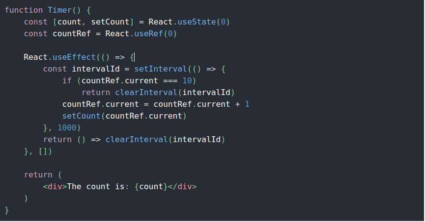
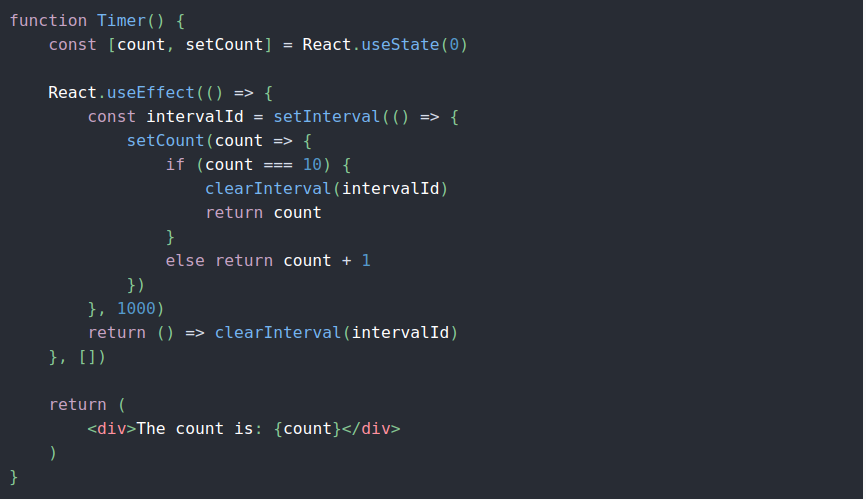

### useRfs

**_nên hạn chế dùng (lý do chưa rõ )_**

link: https://viblo.asia/p/refs-trong-react-la-gi-va-mot-so-truong-hop-su-dung-refs-RnB5p4y65PG

- tạo ra cho mình 1 cái object và object này **_không hay đổi_** sau mỗi lần render

-useRef như là 1 cái box có thể hold bất cứ giá trị nào có thể bị thay đổi

-useRef tạo ra một đối tượng javascript đơn giản, sự khác biệt ở đây là **_{curent:...}_** cung cấp cho bạn cùng 1 đối tượng ref trên mỗi lần kết nối

# useRef

nhanh chống dể dàng

# Not use ref

dể bị callback hell

link :https://leewarrick.com/blog/react-use-effect-explained/
